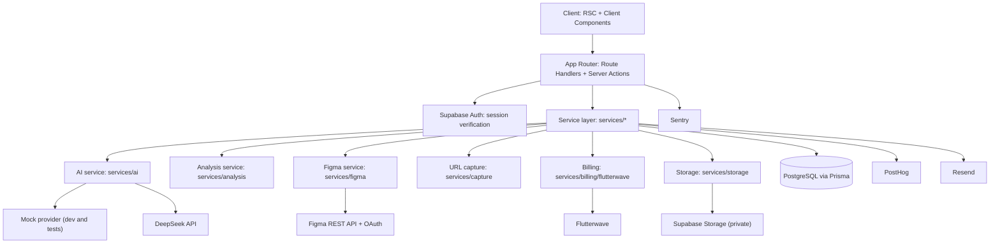
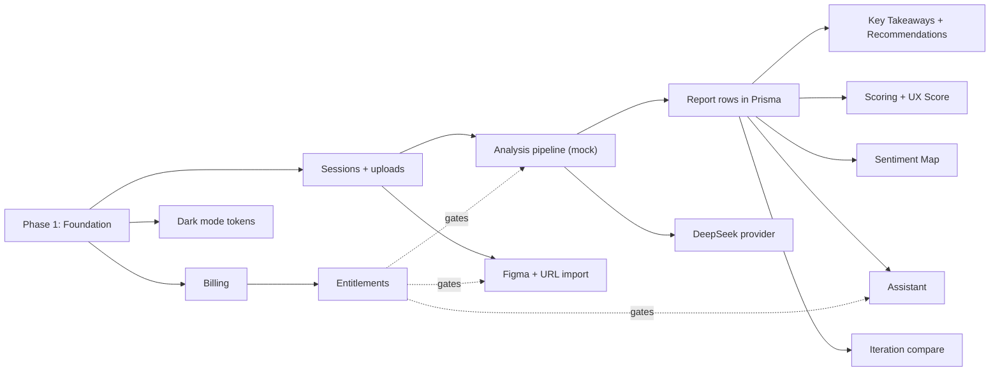

# Vantage AI Implementation Plan

**Status:** Planning only. No application code, schema, or packages exist yet.
**Prepared against:** `AGENTS.md`, `design.md`, all 10 files in `.agents/rules/`, all 5 skills in `.agents/skills/`, and `tokens/`.
**Repository state at time of writing:** greenfield. The folder holds only context files, design tokens, and this plan. There is no application code and no git history.

---

## How to read this document

- **Decision**: a call made to unblock planning, consistent with existing rules.
- **Assumption**: fills a real gap in the docs, labeled so it can be corrected.
- **Note**: context worth surfacing inline.
- **Open question**: needs a maintainer answer before or during the phase it blocks.

---

## 1. Executive Summary

**Vantage AI** gives designers senior-level, principle-based critique on demand. A designer uploads a mock-up, PDF, or Figma frame, states a goal, picks Single Page or Multiple Page Journey and App or Web, and receives a **Design Analysis Report**. The report has five tabs: Key Takeaways, UX Score (Intuitive, Trusted, Valuable), Sentiment (a map of likes and dislikes on the design), Recommendations, and an AI Assistant grounded in that report. Reports are kept in a Design Library so designers can re-analyze new iterations and track improvement.

The report is the product. Everything else exists to produce it quickly, explain it clearly, and keep it trustworthy.

The repository contains the project's constitution and nothing else: `AGENTS.md`, `design.md`, ten always-on rules, five skills, and a compiled token system. The stack is decided: Next.js 15, TypeScript, Tailwind v4, **PostgreSQL through Prisma**, Supabase Auth and Storage, DeepSeek behind an AI service layer, Figma REST API with OAuth, and Flutterwave.

**Implementation strategy:** six phases that follow the product's core loop.

1. Foundation: scaffold, tokens, auth, Prisma schema, app shell.
2. Core analysis loop: sessions, uploads, mocked AI pipeline, report rendering.
3. Report depth: scoring rubric, Sentiment Map, recommendations, assistant.
4. Real AI and imports: DeepSeek integration, Figma link and OAuth import, URL import.
5. Monetization: Flutterwave, entitlements.
6. Dark mode, iteration comparison, and hardening.

The pipeline is built against a **mocked provider** first. DeepSeek is confirmed as the provider but its integration is not ready, and the mock lets every other part ship without waiting.

---

## 2. Repository Assessment

### Already exists

| Path | What it is |
|---|---|
| `AGENTS.md` | Product definition, stack, folder plan, core flows, non-negotiables, decided and open questions |
| `design.md` | Full design system extracted from the Ollio Telehealth reference, with primary rebuilt from #3929CE |
| `.agents/rules/*.md` (10) | accessibility, ai-behavior, analysis-output, architecture, code-style, design-system, naming, performance, security, testing |
| `.agents/skills/*/skill.md` (5) | api-route-scaffolder, component-builder-skill, db-migration-runner, design-analysis-pipeline, flutterwave-integration |
| `tokens/color-tokens.json` | Token source: color primitives, semantic roles, type, spacing, radius, shadow, motion, layout |
| `tokens/convert-tokens.js` | Compiles the JSON into a Tailwind v4 theme plus role variables |
| `tokens/design-tokens.css` | Generated output. Never hand-edited |

### Needs creation

- Next.js 15 App Router scaffold with pnpm, TypeScript strict mode, ESLint, and Prettier.
- `app/globals.css` importing Tailwind and `tokens/design-tokens.css`, plus Open Sauce Two font loading.
- `prisma/schema.prisma`, the initial migrations, and a shared Prisma client in `lib/prisma.ts`.
- Supabase project wiring: Auth clients for server and browser, private Storage buckets, RLS policies.
- AI service layer with a mock provider and a DeepSeek provider slot.
- Figma service for link import and OAuth.
- Flutterwave billing service, checkout, and webhook.
- Resend, PostHog, and Sentry setup.
- `.env.example`.
- `.agents/workflows/`, listed as planned in `AGENTS.md`.
- Test runner setup.
- Git initialization.

### Needs clarification

Covered in Section 23. Headlines: plan limits and confirmation of the RLS and Prisma authorization split.

---

## 3. Context & Rules Audit

| File | Governs | Implementation impact |
|---|---|---|
| `AGENTS.md` | Product, stack, flows, non-negotiables | Tie-breaker for implementation decisions |
| `design.md` | Tokens, layout, component recipes, motion, states | Tie-breaker for visual decisions. Section 12 |
| `architecture.md` | Server-first RSC, service layers, feature folders, response envelope | Shapes every module. Routes are thin, services own logic, Prisma is the only DB client |
| `code-style.md` | Strict TypeScript, token-only styling, import order | Lint and type gate. Bans arbitrary color utilities |
| `design-system.md` | Non-negotiable visual rules and token workflow | Enforced by lint and component review |
| `ai-behavior.md` | Principle library, scoring standards, marker rules, assistant scope, prompt security | Defines Sections 9 and 10 |
| `analysis-output.md` | Report schema, validation, immutability, rendering | Defines the Zod schemas and the Prisma models for findings and recommendations |
| `naming.md` | Casing and naming | Applied to Sections 6, 7, and 21 |
| `accessibility.md` | WCAG 2.1 AA, map and chart text equivalents, live progress | Part of Definition of Done for every screen |
| `performance.md` | Budgets, direct uploads, streaming | Drives the stream-not-queue decision in Section 9 |
| `security.md` | Zero trust, RLS, secrets, SSRF, webhooks | Section 16 |
| `testing.md` | Test priorities, rubric tests, injection fixtures | Section 18 |
| `api-route-scaffolder` | Route layout, envelope, idempotency | Section 10 |
| `component-builder-skill` | Component tree and exact class recipes | Section 11 |
| `db-migration-runner` | Prisma workflow, naming, indexes, soft delete | Section 7 |
| `design-analysis-pipeline` | Stages, prompt assembly, rubric, failure handling | Section 9 |
| `flutterwave-integration` | Payment lifecycle, entitlement keys | Section 13 |
| `tokens/*` | Every visual value | Section 12 |

### Conflicts identified

> **Conflict 1: RLS versus Prisma-only database access.**
> `security.md` says Row Level Security must stay enabled. `architecture.md` says only Prisma talks to PostgreSQL. Prisma connects through one service role, which bypasses RLS.
>
> **Resolution followed:** service-layer ownership checks in every Prisma query are the primary authorization boundary. Every query filters by the server-derived `userId`. RLS stays enabled on every table as defense in depth, and it is the enforced boundary for the paths that touch Supabase directly, which are signed Storage URLs. Details in Section 8. Flagged in Open Questions for confirmation.

> **Conflict 2: "Session" means two things.**
> The UI calls a critique workspace a "Session" ("New Session", "Previous Sessions"). Supabase Auth also has sessions.
>
> **Decision:** the Prisma model is `DesignSession`. The UI keeps the word "Session." Code never uses a bare `Session` type for the product concept.

> **Gap: `.agents/workflows/` does not exist.**
> Recommendation: write `start-session.md` and `run-analysis.md` in Phase 1, since they gate the core loop. Write the others when their features are built.

---

## 4. Product Requirements to Implementation Mapping

**MVP** ships first. **Pro-gated** is MVP but behind VantagePro once limits are decided. **Post-MVP** is planned but deferred.

| Requirement | Implementation area | Depends on | Status |
|---|---|---|---|
| Sign up, sign in, session | Supabase Auth, middleware | Supabase project | MVP |
| New Session composer | `features/sessions`, composer UI | Auth, DB | MVP |
| Upload images and PDFs | Storage service, signed uploads | Storage, DB | MVP |
| Single Page or Multiple Page Journey | Analysis request schema | Composer | MVP. Journey may become Pro-gated |
| App or Web platform choice | Analysis request schema, prompt context | Composer | MVP |
| Paste Figma link | Figma service, frame export | Figma API | MVP |
| Connect Figma account (OAuth) | Figma OAuth, encrypted tokens | Figma app registration | MVP |
| Paste website URL | URL capture service with SSRF guard | Headless capture | MVP |
| Staged analysis progress | SSE stream | AI pipeline | MVP |
| Key Takeaways | Report schema, renderer | AI pipeline | MVP |
| UX Score with Intuitive, Trusted, Valuable | Scoring rubric (code), score UI | Findings | MVP |
| Sentiment Map and grouped findings | Marker validation, map UI | Findings | MVP |
| Smart Recommendations | Recommendation schema, list UI | Findings | MVP |
| AI Assistant chat | Assistant service, streamed | Report | MVP |
| Design Library | Library grid, thumbnails | Sessions, assets | MVP |
| Previous Sessions in sidebar | Sidebar query | Sessions | MVP |
| Re-analyze an iteration and compare | Iteration matching | Analyses | MVP |
| Free and VantagePro plans | Billing, entitlements | Flutterwave | MVP. Limits pending |
| Settings and Privacy | Account, Figma connection, data deletion | Auth | MVP |
| Dark mode | Theme switch, preference cookie | Dark tokens (done) | MVP |
| Report export or sharing | Export service | Reports | Post-MVP |
| Teams and shared libraries | Organizations | Auth model | Post-MVP |
| Custom design-system-aware critique | User-supplied tokens in context | Pipeline | Post-MVP |

---

## 5. System Architecture



### Layer responsibilities

- **Client:** Server Components by default. Client Components only for the composer, drag and drop, report tabs, Sentiment Map, toggles, dialogs, and assistant chat.
- **App/API:** authenticate, validate with Zod, call one service, return the `{ success, data }` or `{ success, error }` envelope.
- **Services:** own all business rules and integrations. Only this layer imports the Prisma client.
- **Database:** PostgreSQL on Supabase, reached only through Prisma.
- **Providers:** DeepSeek, Figma, Flutterwave, Supabase, Resend, PostHog, Sentry, each behind an interface.

---

## 6. Proposed Project Structure

```text
Vantage AI/
├── AGENTS.md
├── design.md
├── .env.example
├── .agents/
│   ├── rules/                       (existing, 10 files)
│   ├── skills/                      (existing, 5 skills)
│   └── workflows/                   (start-session.md and run-analysis.md first)
├── tokens/                          (existing)
├── app/
│   ├── globals.css                  tailwind + tokens + base type
│   ├── (auth)/
│   │   ├── sign-in/page.tsx
│   │   └── sign-up/page.tsx
│   ├── (app)/
│   │   ├── layout.tsx               sidebar + header shell
│   │   ├── page.tsx                 New Session composer
│   │   ├── library/page.tsx         Design Library
│   │   ├── sessions/[sessionId]/
│   │   │   ├── page.tsx             latest report, tabbed
│   │   │   └── iterations/[analysisId]/page.tsx
│   │   └── settings/
│   │       ├── page.tsx             account and privacy
│   │       ├── integrations/page.tsx Figma connection
│   │       └── billing/page.tsx
│   ├── auth/callback/route.ts       Supabase OAuth callback
│   ├── integrations/figma/callback/route.ts
│   └── api/                         see Section 10
├── components/                      ui/, layout/, session/, report/, assistant/, library/
├── features/
│   ├── auth/
│   ├── sessions/                    actions, schemas, queries
│   ├── analysis/                    schemas.ts (report Zod schemas), view models
│   ├── assistant/
│   ├── library/
│   ├── integrations/                figma connection UI logic
│   ├── billing/                     plans.ts (entitlements as data)
│   └── settings/
├── services/
│   ├── ai/
│   │   ├── provider.ts              interface
│   │   ├── providers/mock.ts
│   │   ├── providers/deepseek.ts
│   │   ├── prompts/                 versioned templates
│   │   └── principles/              principle library + standards
│   ├── analysis/
│   │   ├── run-design-analysis.ts
│   │   ├── prepare-assets.ts
│   │   ├── build-context.ts
│   │   ├── validate-report.ts
│   │   ├── match-iterations.ts
│   │   └── scoring/                 rubric.ts, weights.ts
│   ├── assistant/
│   ├── figma/                       oauth.ts, parse-link.ts, export-frames.ts
│   ├── capture/                     url-guard.ts, capture-page.ts
│   ├── storage/                     sign-upload.ts, validate-file.ts, thumbnails.ts, render-pdf.ts
│   ├── billing/flutterwave/
│   ├── email/
│   └── analytics/
├── lib/
│   ├── prisma.ts                    singleton Prisma client
│   ├── supabase/                    server.ts, browser.ts
│   ├── api-response.ts
│   ├── crypto.ts                    token encryption
│   └── logger.ts
├── hooks/
├── prisma/
│   ├── schema.prisma
│   └── migrations/
├── types/
├── public/
├── tests/
│   ├── unit/
│   ├── integration/
│   ├── fixtures/                    sample designs, mock reports, injection cases
│   └── e2e/
└── docs/
    └── implementation-plan.md       (this document)
```

---

## 7. Data Model Plan (Prisma)

All persistence goes through Prisma, per `architecture.md` and `db-migration-runner/skill.md`. The database is Supabase PostgreSQL.

> **Decision: two connection strings.** Prisma uses `DATABASE_URL` through Supabase's connection pooler at runtime, and `DIRECT_URL` for migrations. Both are declared in the `datasource` block.

> **Decision: reports are rows, not a JSON blob.** Findings and recommendations are their own tables. This lets the Sentiment Map, iteration matching, analytics, and the assistant query them directly. The raw validated model output is also kept as JSON for audit.

> **Decision: immutable analyses.** An `Analysis` row and its findings are never updated after `status` becomes `COMPLETE`. Re-analysis creates a new `Analysis` with the next `iteration` number.

### Entities

| Model | Purpose | Key fields | Relationships and constraints |
|---|---|---|---|
| `User` | Mirror of Supabase `auth.users` | `id` (uuid = auth id), `email`, `fullName`, `avatarUrl` | Owner of everything |
| `Subscription` | Current plan per user | `plan` (FREE, VANTAGE_PRO), `status`, `flutterwaveCustomerId`, `currentPeriodEnd`, `cancelAtPeriodEnd` | Unique `userId` |
| `DesignSession` | One design being critiqued | `title`, `pageScope`, `platform`, `goal`, `thumbnailPath`, `latestAnalysisId`, `deletedAt` | FK `userId`. Index `(userId, deletedAt, updatedAt)` for the library and sidebar |
| `Asset` | One uploaded or imported page | `kind` (IMAGE, PDF_PAGE, FIGMA_FRAME, URL_CAPTURE), `source`, `storagePath`, `mimeType`, `width`, `height`, `sizeBytes`, `order`, `figmaFileKey`, `figmaNodeId`, `sourceUrl` | FK `sessionId`. Index `(sessionId, order)` |
| `Analysis` | One immutable report run | `iteration`, `status`, `pageScope`, `platform`, `goal`, scores, `rubricVersion`, `promptVersion`, `principleLibraryVersion`, `model`, `rawOutput` (Json), `durationMs`, `failureReason` | FK `sessionId`. Unique `(sessionId, iteration)` |
| `AnalysisAsset` | Which assets an analysis used | `analysisId`, `assetId`, `order` | Composite PK |
| `KeyTakeaway` | Summary statements | `order`, `text` | FK `analysisId` |
| `Finding` | One observation | `valence`, `severity`, `category`, `principleId`, `standard`, `title`, `observation`, `impact`, `confidence`, `markerX`, `markerY`, `assetId`, `iterationStatus` | FK `analysisId`, `assetId`. Index `(analysisId, valence)` |
| `Recommendation` | One prioritized fix | `rank`, `title`, `change`, `rationale`, `principleId` | FK `analysisId`. Unique `(analysisId, rank)` |
| `RecommendationFinding` | Links fixes to findings | `recommendationId`, `findingId` | Composite PK |
| `SuggestedPrompt` | Assistant starter prompts | `order`, `text` | FK `analysisId` |
| `AssistantMessage` | Chat history | `role`, `content`, `analysisId`, `tokenCount` | FK `sessionId`. Index `(sessionId, createdAt)` |
| `FigmaConnection` | OAuth link to a Figma account | `figmaUserId`, `accessTokenEnc`, `refreshTokenEnc`, `expiresAt`, `scopes` | Unique `userId` |
| `AIRequestLog` | Audit of every model call | `purpose`, `model`, `status`, `durationMs`, `inputTokens`, `outputTokens`, `errorCode` | FK `userId`, optional `analysisId` |
| `Payment` | Payment attempt | `reference`, `flutterwaveTransactionId`, `amount`, `currency`, `status`, `plan` | Unique `reference`. Unique `flutterwaveTransactionId` |
| `PaymentEvent` | Webhook audit trail | `eventType`, `rawPayload`, `signatureValid`, `processedAt` | Optional FK `paymentId` |

Usage limits are counted from `Analysis` and `AssistantMessage` rows per billing period. No separate counter table is needed until profiling says otherwise.

### Schema sketch

This sketch fixes names, relations, and constraints. Field-level details are finalized in Phase 1 migrations.

```prisma
generator client {
  provider = "prisma-client-js"
}

datasource db {
  provider  = "postgresql"
  url       = env("DATABASE_URL")
  directUrl = env("DIRECT_URL")
}

enum Plan { FREE VANTAGE_PRO }
enum SubscriptionStatus { FREE ACTIVE PAST_DUE CANCELLED EXPIRED }
enum PageScope { SINGLE_PAGE JOURNEY }
enum Platform { APP WEB }
enum AssetKind { IMAGE PDF_PAGE FIGMA_FRAME URL_CAPTURE }
enum AnalysisStatus { QUEUED RUNNING COMPLETE FAILED }
enum Valence { LIKE DISLIKE }
enum Severity { CRITICAL MAJOR MINOR STRENGTH }
enum Confidence { HIGH MEDIUM LOW }
enum IterationStatus { NEW PERSISTING RESOLVED }
enum MessageRole { USER ASSISTANT }
enum PaymentStatus { PENDING SUCCESSFUL FAILED CANCELLED }

model User {
  id              String           @id @db.Uuid
  email           String           @unique
  fullName        String?
  avatarUrl       String?
  createdAt       DateTime         @default(now())
  updatedAt       DateTime         @updatedAt
  subscription    Subscription?
  sessions        DesignSession[]
  figma           FigmaConnection?
  payments        Payment[]
  aiRequests      AIRequestLog[]
}

model Subscription {
  id                    String             @id @default(uuid()) @db.Uuid
  userId                String             @unique @db.Uuid
  user                  User               @relation(fields: [userId], references: [id], onDelete: Cascade)
  plan                  Plan               @default(FREE)
  status                SubscriptionStatus @default(FREE)
  flutterwaveCustomerId String?
  currentPeriodEnd      DateTime?
  cancelAtPeriodEnd     Boolean            @default(false)
  createdAt             DateTime           @default(now())
  updatedAt             DateTime           @updatedAt
  payments              Payment[]
}

model DesignSession {
  id               String             @id @default(uuid()) @db.Uuid
  userId           String             @db.Uuid
  user             User               @relation(fields: [userId], references: [id], onDelete: Cascade)
  title            String
  pageScope        PageScope
  platform         Platform
  goal             String?
  thumbnailPath    String?
  latestAnalysisId String?            @unique @db.Uuid
  latestAnalysis   Analysis?          @relation("LatestAnalysis", fields: [latestAnalysisId], references: [id])
  assets           Asset[]
  analyses         Analysis[]         @relation("SessionAnalyses")
  messages         AssistantMessage[]
  createdAt        DateTime           @default(now())
  updatedAt        DateTime           @updatedAt
  deletedAt        DateTime?

  @@index([userId, deletedAt, updatedAt])
}

model Asset {
  id           String          @id @default(uuid()) @db.Uuid
  sessionId    String          @db.Uuid
  session      DesignSession   @relation(fields: [sessionId], references: [id], onDelete: Cascade)
  kind         AssetKind
  storagePath  String
  mimeType     String
  width        Int?
  height       Int?
  sizeBytes    Int
  order        Int
  figmaFileKey String?
  figmaNodeId  String?
  sourceUrl    String?
  createdAt    DateTime        @default(now())
  deletedAt    DateTime?
  analyses     AnalysisAsset[]
  findings     Finding[]

  @@index([sessionId, order])
}

model Analysis {
  id                      String            @id @default(uuid()) @db.Uuid
  sessionId               String            @db.Uuid
  session                 DesignSession     @relation("SessionAnalyses", fields: [sessionId], references: [id], onDelete: Cascade)
  latestFor               DesignSession?    @relation("LatestAnalysis")
  iteration               Int
  status                  AnalysisStatus    @default(QUEUED)
  pageScope               PageScope
  platform                Platform
  goal                    String?
  overallScore            Int?
  intuitiveScore          Int?
  trustedScore            Int?
  valuableScore           Int?
  scoreBreakdown          Json?
  rubricVersion           String?
  promptVersion           String?
  principleLibraryVersion String?
  model                   String?
  rawOutput               Json?
  durationMs              Int?
  failureReason           String?
  createdAt               DateTime          @default(now())
  completedAt             DateTime?
  assets                  AnalysisAsset[]
  takeaways               KeyTakeaway[]
  findings                Finding[]
  recommendations         Recommendation[]
  suggestedPrompts        SuggestedPrompt[]
  messages                AssistantMessage[]
  aiRequests              AIRequestLog[]

  @@unique([sessionId, iteration])
}

model AnalysisAsset {
  analysisId String   @db.Uuid
  analysis   Analysis @relation(fields: [analysisId], references: [id], onDelete: Cascade)
  assetId    String   @db.Uuid
  asset      Asset    @relation(fields: [assetId], references: [id])
  order      Int

  @@id([analysisId, assetId])
}

model KeyTakeaway {
  id         String   @id @default(uuid()) @db.Uuid
  analysisId String   @db.Uuid
  analysis   Analysis @relation(fields: [analysisId], references: [id], onDelete: Cascade)
  order      Int
  text       String
}

model Finding {
  id              String                  @id @default(uuid()) @db.Uuid
  analysisId      String                  @db.Uuid
  analysis        Analysis                @relation(fields: [analysisId], references: [id], onDelete: Cascade)
  assetId         String?                 @db.Uuid
  asset           Asset?                  @relation(fields: [assetId], references: [id])
  valence         Valence
  severity        Severity
  category        String
  principleId     String
  standard        String
  title           String
  observation     String
  impact          String
  confidence      Confidence
  markerX         Float?
  markerY         Float?
  iterationStatus IterationStatus?
  recommendations RecommendationFinding[]

  @@index([analysisId, valence])
}

model Recommendation {
  id          String                  @id @default(uuid()) @db.Uuid
  analysisId  String                  @db.Uuid
  analysis    Analysis                @relation(fields: [analysisId], references: [id], onDelete: Cascade)
  rank        Int
  title       String
  change      String
  rationale   String
  principleId String
  findings    RecommendationFinding[]

  @@unique([analysisId, rank])
}

model RecommendationFinding {
  recommendationId String         @db.Uuid
  recommendation   Recommendation @relation(fields: [recommendationId], references: [id], onDelete: Cascade)
  findingId        String         @db.Uuid
  finding          Finding        @relation(fields: [findingId], references: [id], onDelete: Cascade)

  @@id([recommendationId, findingId])
}

model SuggestedPrompt {
  id         String   @id @default(uuid()) @db.Uuid
  analysisId String   @db.Uuid
  analysis   Analysis @relation(fields: [analysisId], references: [id], onDelete: Cascade)
  order      Int
  text       String
}

model AssistantMessage {
  id         String        @id @default(uuid()) @db.Uuid
  sessionId  String        @db.Uuid
  session    DesignSession @relation(fields: [sessionId], references: [id], onDelete: Cascade)
  analysisId String?       @db.Uuid
  analysis   Analysis?     @relation(fields: [analysisId], references: [id])
  role       MessageRole
  content    String
  tokenCount Int?
  createdAt  DateTime      @default(now())

  @@index([sessionId, createdAt])
}

model FigmaConnection {
  id              String   @id @default(uuid()) @db.Uuid
  userId          String   @unique @db.Uuid
  user            User     @relation(fields: [userId], references: [id], onDelete: Cascade)
  figmaUserId     String
  accessTokenEnc  String
  refreshTokenEnc String
  expiresAt       DateTime
  scopes          String
  createdAt       DateTime @default(now())
  updatedAt       DateTime @updatedAt
}

model AIRequestLog {
  id           String    @id @default(uuid()) @db.Uuid
  userId       String    @db.Uuid
  user         User      @relation(fields: [userId], references: [id], onDelete: Cascade)
  analysisId   String?   @db.Uuid
  analysis     Analysis? @relation(fields: [analysisId], references: [id])
  purpose      String
  model        String
  status       String
  durationMs   Int?
  inputTokens  Int?
  outputTokens Int?
  errorCode    String?
  createdAt    DateTime  @default(now())

  @@index([userId, createdAt])
}

model Payment {
  id                       String         @id @default(uuid()) @db.Uuid
  userId                   String         @db.Uuid
  user                     User           @relation(fields: [userId], references: [id])
  subscriptionId           String?        @db.Uuid
  subscription             Subscription?  @relation(fields: [subscriptionId], references: [id])
  reference                String         @unique
  flutterwaveTransactionId String?        @unique
  amount                   Decimal        @db.Decimal(12, 2)
  currency                 String
  status                   PaymentStatus  @default(PENDING)
  plan                     Plan
  createdAt                DateTime       @default(now())
  updatedAt                DateTime       @updatedAt
  events                   PaymentEvent[]
}

model PaymentEvent {
  id             String    @id @default(uuid()) @db.Uuid
  paymentId      String?   @db.Uuid
  payment        Payment?  @relation(fields: [paymentId], references: [id])
  eventType      String
  rawPayload     Json
  signatureValid Boolean
  processedAt    DateTime?
  createdAt      DateTime  @default(now())

  @@index([paymentId])
}
```

> **Note:** `category`, `principleId`, and `standard` are strings, not enums. The principle library is versioned in code and grows over time. Validation against the library happens in Zod before insert.

### Migration order

Following `db-migration-runner/skill.md`, schema and migration are committed together.

1. `init_users_and_subscriptions`
2. `add_design_sessions_and_assets`
3. `add_analyses_and_report_tables` (Analysis, AnalysisAsset, KeyTakeaway, Finding, Recommendation, RecommendationFinding, SuggestedPrompt)
4. `add_latest_analysis_pointer` (separate step to avoid the circular create order between `DesignSession` and `Analysis`)
5. `add_assistant_messages`
6. `add_figma_connections`
7. `add_ai_request_logs`
8. `add_payments_and_payment_events`
9. `enable_rls_policies` (raw SQL migration, documented, since Prisma does not model RLS)

### Prisma conventions

- One Prisma client singleton in `lib/prisma.ts`, imported only from `services/` and `features/*/queries`.
- Every user-owned read uses `findFirst({ where: { id, userId } })` or a relation filter through `session.userId`. Never a bare `findUnique` by id on user data.
- Report persistence uses a single `prisma.$transaction` so a report is stored completely or not at all.
- Soft deletes use `deletedAt` and every list query filters it.

---

## 8. Authentication & Authorization Plan

### Authentication

- Supabase Auth for email and password sign-in. No Google or social sign-in for now. Never reimplemented.
- Sessions in HTTP-only cookies through Supabase SSR helpers.
- Middleware protects every route under `app/(app)/`.
- On first sign-in, a server action upserts `User` and creates a `FREE` `Subscription` in one transaction.

### Authorization

1. **Primary: service-layer ownership checks** in every Prisma query, scoped by the server-derived `userId`.
2. **Defense in depth: RLS enabled** on every table, and the real boundary for Supabase Storage. Storage paths are `userId/sessionId/assetId.ext`, and bucket policies check the first path segment against `auth.uid()`.

### Figma authorization

- Figma OAuth with read-only file scope.
- Tokens encrypted with AES-GCM in `lib/crypto.ts` using `TOKEN_ENCRYPTION_KEY` before storage.
- Refresh handled server-side. Expired or revoked tokens prompt a reconnect.

### Entitlements

`getEntitlements(userId)` reads `Subscription` and `features/billing/plans.ts` and returns typed limits. Every gated route calls it before work. Limits are placeholders until the maintainer defines plans.

---

## 9. AI Architecture & Analysis Pipeline

Follows `design-analysis-pipeline/skill.md`.

```text
POST /api/sessions/[sessionId]/analyses
        ↓ validate request, ownership, entitlements
        ↓ create Analysis (QUEUED → RUNNING)
        ↓ prepare-assets.ts        downscale, render PDF pages, export Figma frames, capture URLs
        ↓ build-context.ts         goal, scope, platform, principle library, previous iteration summary
        ↓ deterministic checks     contrast, target sizes, resolution
        ↓ provider.analyze()       mock now, DeepSeek later
        ↓ validate-report.ts       Zod against analysis-output.md schema, one corrective retry
        ↓ scoring/rubric.ts        compute scores in code
        ↓ match-iterations.ts      label NEW, PERSISTING, RESOLVED
        ↓ prisma.$transaction      persist report rows, update latestAnalysisId
        ↓ SSE terminal event       client renders Key Takeaways
```

> **Decision: mock provider first.** `services/ai/provider.ts` defines `analyze()`, `chat()`, and `summarize()`. `providers/mock.ts` returns schema-valid reports from fixtures. Phases 2 and 3 ship entirely against it. Phase 4 adds `providers/deepseek.ts` without touching callers.

> **Decision: stream, do not queue.** A Single Page analysis fits the 30-second budget inside one request. Progress is streamed with Server-Sent Events. Journeys analyze pages concurrently. If journeys regularly exceed 60 seconds, move them to a background job. Tracked in Risks.

### Model use

| Task | Model tier |
|---|---|
| Design analysis from images | DeepSeek image-capable model |
| Assistant chat, titles, suggested prompts | DeepSeek text model |

If the DeepSeek integration cannot read images at launch, the provider interface allows a different image model for `analyze()` only. That is a maintainer decision, not an automatic fallback.

### Scoring

- Rubric in `services/analysis/scoring/`, pure and fully unit-tested.
- Each finding cites a standard: Nielsen heuristics, Jakob's Law and the Laws of UX, Gestalt, WCAG 2.1 AA, or platform guidelines.
- Each dimension starts at 100 and loses weighted points per finding. Overall is the average of the three.
- Weights live in `weights.ts`. `rubricVersion` is stamped on every analysis.

### Assistant

- Streamed `POST /api/sessions/[sessionId]/assistant`.
- Context: latest report summary, referenced findings, last N messages.
- Scoped to design critique. Off-topic requests are redirected.

### Failure handling

- Failed runs set `status = FAILED` with a user-safe `failureReason`. Assets are never deleted.
- The previous analysis stays the session's latest until a new one completes.

---

## 10. API Plan

Every route authenticates, validates with Zod, calls one service, and returns the standard envelope.

### Sessions

| Endpoint | Purpose | Auth / entitlement | Service |
|---|---|---|---|
| `GET /api/sessions` | Library and sidebar list, cursor-paginated | Session | `sessions.list` |
| `POST /api/sessions` | Create a session from the composer | Session | `sessions.create` |
| `GET /api/sessions/[sessionId]` | Session with latest report | Ownership | `sessions.get` |
| `PATCH /api/sessions/[sessionId]` | Rename | Ownership | `sessions.update` |
| `DELETE /api/sessions/[sessionId]` | Soft delete | Ownership | `sessions.remove` |

### Analyses

| Endpoint | Purpose | Auth / entitlement | Service |
|---|---|---|---|
| `POST /api/sessions/[sessionId]/analyses` | Start an analysis, streamed progress | Ownership + analysis quota + journey entitlement | `analysis.run` |
| `GET /api/sessions/[sessionId]/analyses` | Iteration list | Ownership | `analysis.list` |
| `GET /api/analyses/[analysisId]` | Stored report | Ownership | `analysis.get` |

### Assistant

| Endpoint | Purpose | Auth / entitlement | Service |
|---|---|---|---|
| `GET /api/sessions/[sessionId]/assistant` | Message history | Ownership | `assistant.history` |
| `POST /api/sessions/[sessionId]/assistant` | Ask a question, streamed | Ownership + message quota | `assistant.reply` |

### Uploads and imports

| Endpoint | Purpose | Auth / entitlement | Service |
|---|---|---|---|
| `POST /api/uploads/sign` | Signed upload URL after type and size checks | Ownership | `storage.signUpload` |
| `POST /api/uploads` | Confirm upload, create `Asset`, build thumbnail | Ownership | `storage.recordUpload` |
| `DELETE /api/uploads/[assetId]` | Remove an unused asset | Ownership | `storage.removeAsset` |
| `POST /api/imports/figma` | Import frames from a Figma link | Ownership + Figma access | `figma.importFrames` |
| `POST /api/imports/url` | Capture a public web page | Ownership | `capture.capturePage` |

### Integrations

| Endpoint | Purpose | Auth |
|---|---|---|
| `GET /api/integrations/figma/connect` | Start Figma OAuth | Session |
| `GET /integrations/figma/callback` | Complete OAuth, store encrypted tokens | Session + state check |
| `DELETE /api/integrations/figma` | Disconnect Figma | Session |

### Billing

| Endpoint | Purpose | Auth | Service |
|---|---|---|---|
| `POST /api/billing/checkout` | Start Flutterwave checkout | Session | `billing.createCheckout` |
| `POST /api/billing/webhook` | Verify and process events | Signature only | `billing.handleWebhook` |
| `GET /api/billing/subscription` | Plan and entitlements | Session | `billing.getSubscription` |
| `POST /api/billing/cancel` | Stop renewal | Session | `billing.cancel` |

### System

| Endpoint | Purpose | Auth |
|---|---|---|
| `GET /api/health` | Uptime probe | None |
| `GET /auth/callback` | Supabase OAuth callback | None |

---

## 11. UI & Component Plan

All screens follow `design.md` and the recipes in `component-builder-skill/skill.md`.

| Screen | Primary components | Notes |
|---|---|---|
| Sign in / Sign up | `ui/input`, `ui/button` | Single centered card, max width 440px, ChatGPT-style pill fields (see design.md, Authentication screens) |
| App shell | `layout/app-shell`, `layout/sidebar`, `layout/header` | Sidebar: New Session, Design Library, Previous Sessions, Settings and Privacy, Upgrade to VantagePro |
| New Session | `session/composer`, `session/asset-thumbnail` | Greeting, attachments, goal, Single Page or Journey, App or Web |
| Analysis progress | `session/analysis-progress` | Staged list in a live region |
| Report: Key Takeaways | `report/key-takeaways` | First tab after completion |
| Report: UX Score | `report/score-card`, `report/score-dimension-card`, `report/score-chart` | Values always shown as text |
| Report: Sentiment Map | `report/sentiment-map`, `report/sentiment-marker`, `report/finding-item` | View Maps toggle, Likes and Dislikes filter |
| Report: Recommendations | `report/recommendation-list` | Ranked, linked to findings |
| Report: Assistant | `assistant/*` | Side panel on `xl`, tab below |
| Iteration compare | Score deltas, NEW / PERSISTING / RESOLVED badges | Reuses report components |
| Design Library | `library/library-grid`, `library/library-card` | Teaching empty state |
| Settings | Account, Figma connection, data deletion, billing, payment history | Dialogs for destructive actions |
| Upgrade | `ui/dialog` plan comparison | Secondary button style with sparkle icon |

Every list and async view handles loading, empty, error, and success.

---

## 12. Design System Implementation

- `app/globals.css` imports Tailwind, then `tokens/design-tokens.css`, then the body and `.cv01` base styles from `design.md`.
- Tailwind's default palette is removed by the token theme, so only Vantage colors compile.
- An ESLint rule (or `eslint-plugin-tailwindcss` config) rejects arbitrary color values like `bg-[#...]`.
- Open Sauce Two 400, 500, and 600 via `@fontsource/open-sauce-two`.
- Lucide React for all icons.

### Dark mode

> **Done in the token layer.** Dark roles were translated from the Figma file and added under `color.dark`. The converter emits `[data-theme="dark"]` and a `prefers-color-scheme` block. Contrast is checked in `design.md`.

> **Decision: theme-aware utilities.** Components use utilities such as `bg-surface`, `text-fg`, `border-line`, `bg-action`, and `text-accent`. They are generated in an `@theme inline` block that points to the role variables, so every component switches theme with no extra code.

Remaining build work:

- Read the theme preference cookie in the root layout and set `data-theme` on `<html>` during server render to avoid a flash.
- Add the Light / Dark / System control to Settings and Privacy.
- Add an ESLint rule that rejects `bg-white`, `text-grey-*`, and other light-only utilities in components, except the documented exceptions.

---

## 13. Payment & Subscription Architecture

Flutterwave only, per `flutterwave-integration/skill.md`.

```text
Upgrade to VantagePro
        ↓ POST /api/billing/checkout → Payment (PENDING) + Flutterwave checkout
Flutterwave hosted checkout
        ↓
POST /api/billing/webhook
        ↓ 1. verify signature
        ↓ 2. validate payload (Zod)
        ↓ 3. confirm transaction with Flutterwave API
        ↓ 4. reject duplicate reference (unique constraint)
        ↓ 5. update Payment, write PaymentEvent
        ↓ 6. Subscription → VANTAGE_PRO, ACTIVE, currentPeriodEnd
        ↓ 7. log
Next request sees new entitlements
```

- Idempotency is enforced by the unique `Payment.reference`.
- Client redirect status is never trusted.
- Cancellation stops renewal and keeps access to period end.
- Plan prices and limits are set in `features/billing/plans.ts` once decided.

---

## 14. Upload, Import & Asset Architecture

```text
Composer
  ├── File upload
  │     POST /api/uploads/sign → type, size, ownership checks → signed URL
  │     Browser PUTs directly to private Supabase Storage
  │     POST /api/uploads → verify object exists → Asset row → WebP thumbnail
  ├── PDF
  │     Same as upload, then render-pdf.ts creates one PDF_PAGE asset per page
  ├── Figma link
  │     parse-link.ts → fileKey + nodeIds
  │     OAuth token if connected, else link access
  │     Figma images API → export PNG → store → FIGMA_FRAME assets
  └── URL
        url-guard.ts → https only, DNS resolve, block private ranges
        capture-page.ts → headless screenshot with timeout and size cap → URL_CAPTURE asset
```

- Formats: PNG, JPG, JPEG, WebP, PDF. File type is checked by magic bytes.
- Buckets are private. Reads use short-lived signed URLs.
- Images are downscaled for the model and thumbnailed for the library.
- Assets are soft-deleted with their session and purged on permanent deletion.

> **Assumption: URL capture runtime.** Headless browser capture needs a runtime that supports Chromium, such as `@sparticuz/chromium` on Vercel functions or a small external capture service. Decide in Phase 4.

---

## 15. Report Rendering Architecture

```text
Model output (JSON)
        ↓ Zod validation (analysis-output.md)
        ↓ rubric scoring in code
        ↓ Prisma transaction → report rows
        ↓ Server Component loads report with one query (includes)
        ↓ Text fields rendered with a sanitizing Markdown renderer (bold, italic, lists, inline code only)
        ↓ Sentiment Map markers rendered as accessible buttons over the image
```

Stored reports render without calling the AI again. Report export is Post-MVP and will read the same rows.

---

## 16. Security Plan

| Threat | Mitigation |
|---|---|
| Cross-account access | Ownership-scoped Prisma queries, RLS, path-scoped storage policies |
| Malicious uploads | Magic-byte type checks, size caps, no SVG |
| SSRF through URL or Figma import | https only, DNS resolution with private-range blocking, timeouts, size caps |
| Prompt injection through text in designs | Untrusted content delimited in prompts, system prompt precedence, injection fixtures in tests |
| Unvalidated AI output | Zod validation before persistence |
| XSS in report text | Restricted sanitizing renderer, no raw HTML |
| Figma token theft | AES-GCM encryption at rest, read-only scope, server-only use |
| Forged or replayed webhooks | Signature check, server-side confirmation, unique reference |
| AI cost abuse | Rate limits and quotas on analysis, assistant, uploads, imports |
| Secret leakage | Env vars only, never logged, never in prompts or reports |
| NDA designs exposed | Private buckets, no public sharing in MVP, deletion on request |

---

## 17. Performance & Scalability Plan

| Operation | Budget | How it is met |
|---|---|---|
| Library and session load | < 2s | Server Components, cursor pagination, `(userId, deletedAt, updatedAt)` index |
| Upload acknowledgement | < 1s | Direct-to-storage uploads |
| Single Page analysis | < 30s | Downscaled images, parallel stages, streamed progress |
| Journey analysis | < 60s | Concurrent page analysis with a limit, one cross-page pass |
| Assistant first token | < 3s | Streaming, compact context |
| Stored report render | < 500ms | One Prisma query with includes, no AI call |

Main risk: provider latency and rate limits. Mitigated by streaming, minimal context, and the provider abstraction.

---

## 18. Testing Strategy

> **Assumption: Vitest + Testing Library for unit, integration, and component tests, and Playwright for end to end.** Matches the Design.md Generator plan. Correct early if Jest is preferred.

| Layer | Covers | Required before MVP |
|---|---|---|
| Unit | Rubric, weights, Zod schemas, URL guard, Figma link parser, entitlement logic, iteration matching | Yes |
| Integration | Routes with auth and ownership, Prisma queries against a test database, report transaction | Yes |
| AI contract | Mock provider fixtures, invalid outputs rejected, injection fixtures ignored | Yes |
| Payments | Full Flutterwave checklist | Yes |
| Component | Report tabs, Sentiment Map, composer, all four states | Yes |
| Accessibility | axe on every page, keyboard walkthrough of the core loop | Yes |
| End to end | Sign up → upload → analyze → report → assistant; upgrade → webhook → entitlement | Yes |

The test database is a separate Postgres instance. `prisma migrate reset` runs only against it.

---

## 19. Implementation Phases

### Phase 1: Foundation

> **Status (2026-10-07): code complete, not yet connected to Supabase.** Scaffold, tokens, Prisma schema for migrations 1 and 2, auth flow, app shell, theme switch, workflows, and tests are built. Type check, lint, 35 unit tests, and a production build pass. Remaining: create the Supabase project, fill `.env.local`, run the first migration, and add the storage bucket and RLS policies. Sentry, PostHog, and Resend are not wired yet.

- Git init, Next.js 15, TypeScript, pnpm, ESLint, Prettier.
- `app/globals.css` with tokens, font, and base type. Root layout sets `data-theme` from the preference cookie.
- Supabase project: Auth, private Storage bucket, storage policies.
- Prisma: schema migrations 1 and 2, `lib/prisma.ts`.
- First-sign-in user and subscription creation.
- App shell: sidebar, header, empty New Session and Library screens.
- Write `start-session.md` and `run-analysis.md` workflows.
- Sentry, PostHog, Resend wired.

### Phase 2: Core analysis loop (mock provider)

> **Status (2026-10-07): built and tested, except PDF rendering.** Done: migrations 2 to 4, the composer with image uploads, the Upload Images and My Goal steps, the streamed analysis route, the demo provider, report validation, the persistence transaction, all report tabs, the Design Library, and Previous Sessions. Not done: PDF page rendering (PDFs are not accepted yet).
>
> **Deviations from this plan:**
> - Uploads pass through `POST /api/sessions/[sessionId]/assets` instead of signed direct uploads, so each file is checked by its real contents before it is stored. Move to signed uploads once Supabase is connected.
> - The session cover is `DesignSession.coverAssetId` (migration 4), not a path.
> - The migrations are `init_users_sessions_assets`, `add_analyses_and_report`, `add_assistant_messages`, and `session_cover_asset`.
> - Local development runs on Prisma's local Postgres (`pnpm db:dev`), a fake sign-in (`DEV_AUTH`), and disk storage. All three are impossible to enable in production, and tests enforce that.

- Migration 3 and 4.
- Composer with uploads and PDF rendering.
- Analysis route with SSE progress.
- Mock provider, Zod report schemas, persistence transaction.
- Key Takeaways and Recommendations tabs.
- Design Library and Previous Sessions.

### Phase 3: Report depth

> **Status (2026-10-07): built and tested.** Done: the scoring rubric (v1.0.0) and principle library (v1.0.0), the UX Score tab with the donut and three dimension cards, the Sentiment Map with markers and findings, recommendations, the assistant with saved history, and iteration comparison. 106 unit tests and 28 browser tests (both themes, with automated accessibility audits) pass.
>
> **Needs your decision:** the rubric constants in `services/analysis/scoring/rubric.ts` give most designs 85 to 95. Calibrate them against real analyses once the real model is connected.

- Scoring rubric and weights, UX Score tab.
- Sentiment Map with markers and grouped findings.
- Migration 5. Assistant chat with suggested prompts (mock).
- Re-analysis and iteration comparison.

### Phase 4: Real AI and imports

- DeepSeek provider for `analyze()` and `chat()`.
- Principle library v1 with standards.
- Migration 6. Figma link import and OAuth.
- URL capture with SSRF guard.
- Migration 7. AI request logging.

### Phase 5: Monetization

*Can run in parallel with Phases 3 and 4 after Phase 1.*

- Migration 8. Flutterwave checkout and webhook.
- `plans.ts` and `getEntitlements`, retrofitted onto analysis, journey, assistant, and import routes.
- Upgrade dialog, billing settings, payment history.

### Phase 6: Dark mode and hardening

- Light / Dark / System control in Settings and Privacy. Tokens and utilities already exist, so every screen supports both themes from Phase 1.
- Migration 9. RLS policies on every table.
- Accessibility, performance, and test hardening.
- Empty and error state audit.

---

## 20. Dependency Graph



Billing and dark-mode token work can proceed in parallel with the analysis work.

---

## 21. Environment Configuration

Names only.

| Category | Variables |
|---|---|
| Application | `NEXT_PUBLIC_APP_URL`, `NODE_ENV` |
| Database (Prisma) | `DATABASE_URL` (pooled), `DIRECT_URL` (migrations) |
| Supabase | `NEXT_PUBLIC_SUPABASE_URL`, `NEXT_PUBLIC_SUPABASE_ANON_KEY`, `SUPABASE_SERVICE_ROLE_KEY` |
| AI | `AI_PROVIDER` (`mock` or `deepseek`), `DEEPSEEK_API_KEY` |
| Figma | `FIGMA_CLIENT_ID`, `FIGMA_CLIENT_SECRET`, `FIGMA_REDIRECT_URI` |
| Encryption | `TOKEN_ENCRYPTION_KEY` |
| Flutterwave | `FLW_PUBLIC_KEY`, `FLW_SECRET_KEY`, `FLW_WEBHOOK_SECRET`, `FLW_ENCRYPTION_KEY` |
| Email | `RESEND_API_KEY` |
| Analytics and monitoring | `NEXT_PUBLIC_POSTHOG_KEY`, `POSTHOG_HOST`, `SENTRY_DSN` |

`.env.example` with placeholders ships in Phase 1.

---

## 22. Risks & Mitigations

| Risk | Mitigation |
|---|---|
| DeepSeek image support is not ready at launch | Mock provider unblocks all other work. The provider interface allows a different image model for `analyze()` if the maintainer approves |
| AI output does not match the schema | Zod validation with one corrective retry, then a clear failure with Retry |
| Findings feel generic or wrong | Principle library with cited standards, deterministic checks, reference-design evaluation set |
| Scores feel arbitrary | Rubric in code, breakdown always shown, versioned weights |
| Markers land in wrong places | Normalized coordinates, bounds validation, no marker when confidence is low |
| Journey analysis exceeds budget | Concurrency limits, then a background job if needed |
| URL capture is slow or blocked | Timeouts and size caps. Figma and uploads remain available |
| Figma API rate limits | Cache exported frames by file key and node ID |
| Components hardcode light-only classes and break dark mode | Theme-aware utilities everywhere, plus a lint rule against light-only classes |
| Prisma and RLS mismatch | Ownership-scoped queries as primary boundary, RLS as defense in depth |
| Cost abuse | Quotas, rate limits, AI request logging |

---

## 23. Open Questions

**1. Plan limits.** What Free and VantagePro include. Blocks the final values in `plans.ts` in Phase 5. Maintainer to provide.

**2. Sentiment Map rename.** Resolved. The Figma "Valency" tab is renamed Sentiment Map. `Valence` stays as the internal enum.

**3. Dark-mode token values.** Resolved. Translated from Figma into `tokens/color-tokens.json`.

**4. RLS and Prisma authorization split.** Confirm service-layer checks as the primary boundary with RLS as defense in depth. Blocks Phase 1 database finalization.

**5. URL capture runtime.** Serverless Chromium on Vercel or an external capture service. Blocks Phase 4 URL import.

**6. Workflow authorship timing.** Write all workflows now or just in time. This plan recommends just in time. `start-session.md` and `run-analysis.md` exist already.

**7. Light-mode input border contrast.** The reference product's input border (`grey-300` on white) is about 1.5:1, below the 3:1 that WCAG 1.4.11 asks for. Dark mode passes. Options: add a darker light border token near #8A93A3, or keep the reference value. Blocks nothing today. Decide before the first public release.

---

## 24. Implementation Order

1. Git init, scaffold, lint and format config.
2. `globals.css` with tokens, font, and base styles.
3. Supabase Auth and private Storage bucket.
4. Prisma schema, migrations 1 and 2, client singleton.
5. App shell with empty New Session and Library screens.
6. Composer and uploads, including PDF rendering.
7. Report schemas, mock provider, analysis route with streamed progress, migrations 3 and 4.
8. Key Takeaways, Recommendations, Design Library.
9. Scoring rubric and UX Score.
10. Sentiment Map.
11. Assistant, migration 5.
12. Iteration comparison.
13. DeepSeek provider and principle library v1.
14. Figma link and OAuth import, URL capture, migrations 6 and 7.
15. Billing and entitlements, migration 8, then gates on steps 7 to 14.
16. Theme switch and preference cookie (dark tokens already exist).
17. RLS policies, migration 9.
18. Accessibility, performance, and test hardening.

---

## 25. Definition of Done

| Area | Criteria |
|---|---|
| Functional | Upload or import a design, analyze it, read all five report tabs, ask the assistant, find it in the library, re-analyze and compare |
| Data | All persistence through Prisma. Reports stored in one transaction. Analyses immutable |
| AI output | Every stored report passes Zod validation. Every finding cites a principle and standard. Scores computed by the rubric |
| Security | Every item in `security.md` and Section 16 verified. Figma tokens encrypted. SSRF guard tested |
| Payments | Server-side verification, signature checks, duplicate references rejected by the database |
| Design | Every screen matches `design.md`. No arbitrary colors. Light and dark themes pass contrast |
| Accessibility | WCAG 2.1 AA on the core loop, including map and chart text equivalents |
| Performance | All Section 17 budgets met under realistic load |
| Testing | Section 18 required layers pass in CI with no live external services |

---

*Prepared from the repository's context files. No application code, packages, migrations, or database changes were created while producing this document.*
